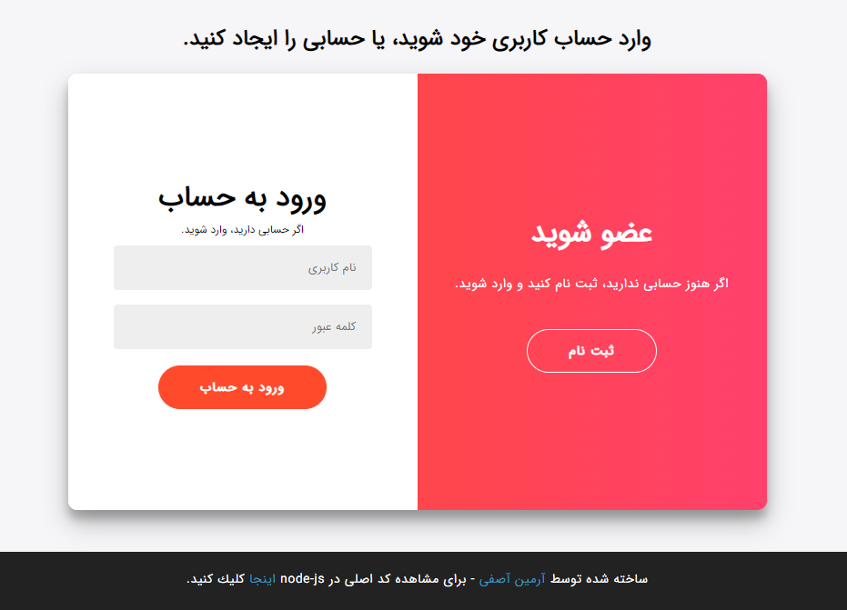
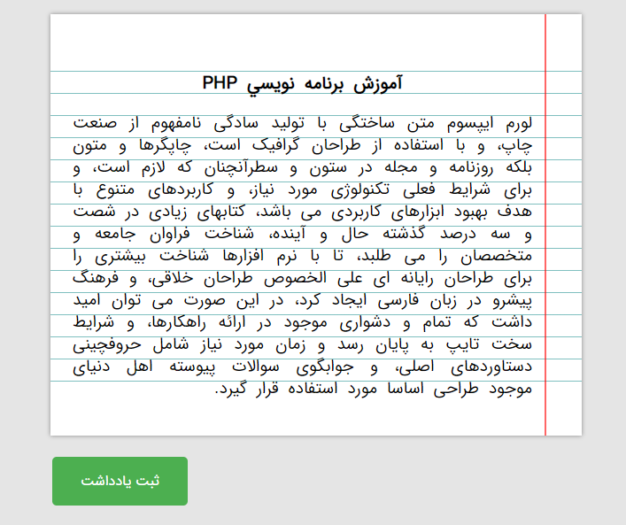
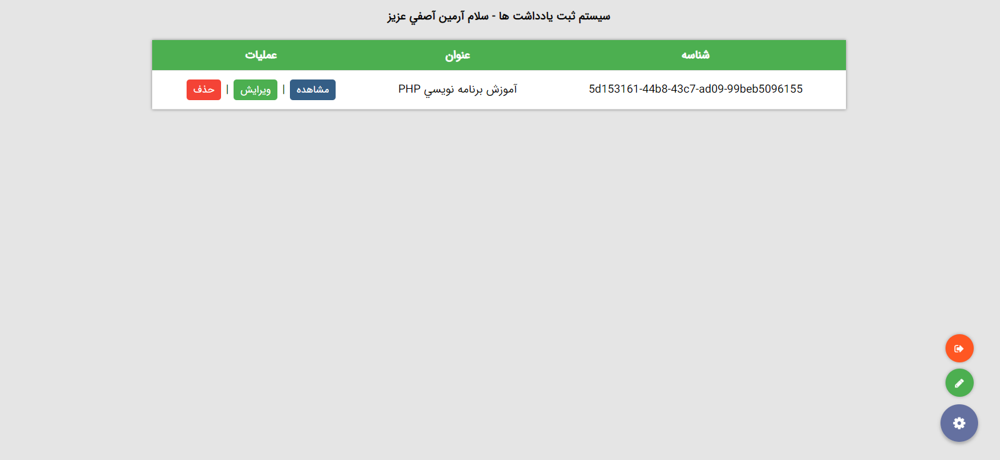

# My Notes
## _The Pure Semi PHP MVC Note Management System_

[](https://travis-ci.org/joemccann/dillinger)

My Notes is a semi php mvc project that helps note management,
it uses MySQL as database solution and custom type of mvc coding.

- Clean Coded 🧹
- Safe and Suitable for educational purposes 🔐👨‍🎓
- ✨Tested ✨

## Features

- Easily setupable
- Account system (every user can only access to itself data)
- Create notes
- Edit, Delete notes
- Session based

As i mentioned, it's semi php mvc. but what it means?
i used mvc structure to handle requests, created models for users and notes and more stuff, but the views are not like what is in real mvc, there is no routing system, just direcotry routing tricks.

## Screenshots

| Name | Image |
| ------ | ------ |
| Setup |  |
| Account | [] |
| Add note | [] |
| Dashboard | [] |

## Tech

My Notes uses a number of open source projects to work properly:

- [PHP](https://php.net) - Backend programming language.
- [MySQL](https://www.mysql.com) - Database solution.
- [jQuery](https://jquery.com) - front end request solutions.

And of course 'My Notes' itself is open source with a [public repository](https://github.com/0xDeviI/My-Notes)
 on GitHub.

## Installation

'My Notes' requires [PHP](https://php.net/) v7+ to run.

- 1- Install the dependencies and devDependencies and start the server.
- 2- Locate your webserver's home location. 

```bat
mkdir MyNotes
git clone https://github.com/0xDeviI/My-Notes.git
cp "My Notes" MyNotes
```

After git fetched repo completly, run 'VS Code' on your system using

```bat
code .
```

Then search for 'localhost' and replace it with your own server accessible ip address.

> Note: IP should only change in these files:

- assets/login/js/app.js
- assets/main/js/app.js
- assets/notes/js/addnote.js
- assets/notes/js/editnote.js

After that, it's almost finished. just 2 more steps:
- 1- login to your 'MySQL command line' or 'phpmyadmin' and create a database called `my_notes`.
- 2- just navigate to http://[your-server-ip]/MyNotes and you should redirect to setup page to setup and install the app. In setup page, enter MySQL information installed on server.
> Note: the defualts are:
- Host: `localhost` or `127.0.0.1`
- Port: `3306` which is MySQL port
- Username: `root`
- Password: Does not have a password
- Database Name: `my_notes`.

## License

[MIT](LICENSE)

**Free Software, Hell Yeah!**
